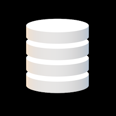

  

Car Collection
=======================

Car Collection Database is a hobby project that transforms the mundane task of looking up Dutch license plates into an engaging and informative experience. Designed for car enthusiasts and casual users alike, this Android app offers detailed statistics and information about vehicles just from their license plates. Whether you're looking to learn more about a car you've spotted or you're gathering data for personal or academic purposes, Car Collection Database has got you covered.

Features
--------

*   **License Plate Lookup**: Easily find comprehensive details and statistics about vehicles registered in the Netherlands by entering their license plate numbers.
*   **Favorites Collection**: Keep track of interesting finds by saving them to your personal favorites list. Our local database system ensures that your collection is always at your fingertips, even when offline.
*   **User Engagement**: Discover fun advancements designed to motivate users to collect and explore app entries. Perfect for car enthusiasts looking to add a gamified twist to their passion.
*   **Seamless Interface**: Enjoy a user-friendly interface that makes navigation and data retrieval a breeze.

Media
--------

Getting Started
---------------

To get started with Car Collection Database, follow these simple steps:

1.  **Install the App**: Download the app from the [Google Play Store](https://play.google.com/store/apps/details?id=com.laurens.carcollectiondatabase).
2.  **Launch the App**: Open the app on your Android device.
3.  **Lookup License Plates**: Start by entering a Dutch license plate to retrieve vehicle information.
4.  **Save Favorites**: Use the favorites feature to bookmark vehicles of interest.
5.  **Explore and Enjoy**: Dive into the app's features and enjoy the journey of discovering and collecting vehicle data.

Built With
----------

*   Android Studio - The IDE used for Android app development
*   SQLite - For local database management
*   Retrofit - For network requests to vehicle data APIs

Contributing
------------

As a hobby project, contributions are always welcome! Whether it's suggesting new features, reporting bugs, or improving the codebase, feel free to fork the repository and submit a pull request.

License
-------

This project is licensed under the MIT License - see the LICENSE.md file for details.

Acknowledgments
---------------

*   Thanks to all the car enthusiasts and users who have provided feedback and support.
*   Special thanks to the APIs and open data sources that make this project possible.
